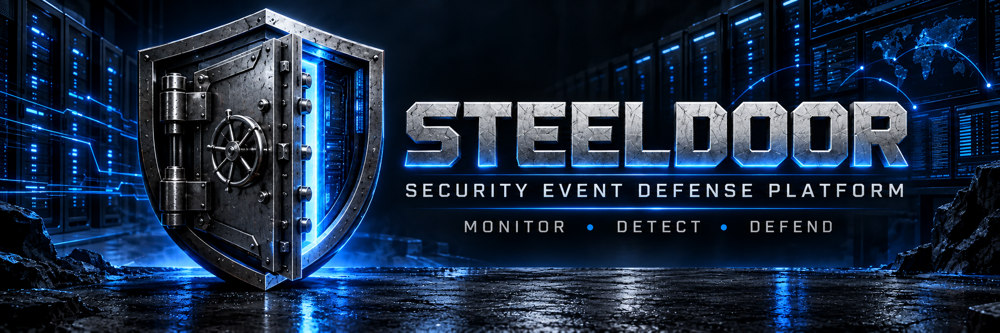

[](https://github.com/TYSECRD/SteelDoor/actions/workflows/ci.yml)

**SteelDoor** is a Python-based security-event monitoring and threat-detection API built as a hands-on DevSecOps portfolio project.

The project demonstrates secure API development, authentication, rate limiting, automated threat detection, structured security logging, persistent storage, container hardening, vulnerability management, automated testing, and CI security controls.

SteelDoor v1 is designed to show not only how an application can be built, but how security can be integrated throughout the development and deployment lifecycle.

---

## Project Goals

SteelDoor was built to practice and demonstrate core DevSecOps concepts in one working application:

* Build a REST API with FastAPI
* Validate and store security-event data
* Detect suspicious authentication activity
* Protect API endpoints
* Apply rate limiting
* Produce security logs and alerts
* Write automated tests
* Scan source code and dependencies
* Package the application with Docker
* Harden the container runtime
* Persist application data outside disposable containers
* Scan the finished container image
* Automatically repeat security checks through CI

---

# Current Features

## Security Event API

SteelDoor can:

* Ingest security events through a REST API
* Validate IPv4 and IPv6 source addresses
* Enforce approved severity levels
* Assign unique event IDs
* Record UTC timestamps
* Store events in SQLite
* Retrieve recorded events
* Filter events by severity
* Track investigation status
* Reject malformed event data

Supported event statuses:

```text
new
investigating
resolved
```

Supported severity levels:

```text
low
medium
high
critical
```

---

## API-Key Authentication

Protected SteelDoor endpoints require an API key supplied through:

```text
X-API-Key
```

The runtime key is loaded from:

```text
STEELDOOR_API_KEY
```

The key is not hard-coded into the application source code or Docker image.

Sensitive values are compared using:

```python
secrets.compare_digest()
```

Missing or invalid credentials return:

```text
401 Unauthorized
```

SteelDoor also fails closed when the server-side API key is missing.

---

## Rate Limiting

SteelDoor contains an in-memory per-client rate limiter.

Current policy:

```text
20 requests
per 60-second window
per client
```

Clients exceeding the limit receive:

```text
429 Too Many Requests
```

with:

```text
Retry-After: 60
```

This implementation is intentionally lightweight for SteelDoor v1.

A production distributed deployment could move rate-limit state to a shared system such as Redis.

---

# Threat Detection

## Brute-Force Detection

SteelDoor analyzes failed-login security events for repeated authentication attempts.

Current detection rule:

```text
5 failed-login events
from the same source IP
within 5 minutes
```

Activity outside the detection window is excluded.

```text
Failed Login
     |
Failed Login
     |
Failed Login
     |
Failed Login
     |
Failed Login
     |
     v
SteelDoor Detection Engine
     |
     v
BRUTE_FORCE_ATTEMPT
Severity: HIGH
```

When the rule triggers, SteelDoor generates a structured alert similar to:

```json
{
  "rule": "BRUTE_FORCE_ATTEMPT",
  "source_ip": "10.10.10.50",
  "severity": "high",
  "message": "Possible brute-force attack detected"
}
```

This separates raw security-event ingestion from detection results.

---

# Security Logging

SteelDoor includes dedicated security logging for security-relevant application activity.

Examples include:

* Invalid or missing API-key attempts
* Rate-limit violations
* Detection activity

Security logs can include:

```text
timestamp
event type
client IP
security message
```

Example:

```text
timestamp=2026-09-02T22:46:10+00:00
event=invalid_api_key
client_ip=127.0.0.1
message=Invalid or missing API key
```

Automated tests verify that invalid authentication attempts generate security logs.

---

# Security Architecture

Protected requests pass through multiple controls before reaching application logic.

```text
Client Request
      |
      v
API-Key Authentication
      |
      v
Constant-Time Secret Validation
      |
      v
Per-Client Rate Limiting
      |
      v
FastAPI Endpoint
      |
      v
Pydantic Input Validation
      |
      v
Detection Engine
      |
      v
SQLite Persistence
      |
      +------> Security Logging
      |
      +------> Structured Alerts
```

SteelDoor uses **defense in depth** rather than depending on a single security control.

---

# Container Architecture

SteelDoor is packaged with Docker using:

```text
python:3.13-slim
```

The application is designed so the container itself can be disposable while application data survives separately.

```text
Host
 |
 +-- Docker
      |
      +-- SteelDoor Container
      |     |
      |     +-- FastAPI
      |     +-- Detection Engine
      |     +-- Security Controls
      |     +-- Read-Only Application Filesystem
      |
      +-- Persistent Docker Volume
            |
            +-- steeldoor.db
```

---

# Docker Security Hardening

SteelDoor's container runtime is hardened using several independent controls.

## Non-Root Execution

The application runs as a dedicated Linux user:

```text
steeldoor
```

Runtime verification:

```bash
docker exec steeldoor id
```

Expected result:

```text
uid=1000(steeldoor)
gid=1000(steeldoor)
```

The application does not run as:

```text
uid=0(root)
```

This applies the principle of least privilege.

---

## Linux Capabilities

All additional Linux capabilities are removed:

```yaml
cap_drop:
  - ALL
```

This limits the privileges available to a compromised application process.

---

## Privilege Escalation Protection

The runtime also uses:

```yaml
security_opt:
  - no-new-privileges:true
```

This prevents processes inside the container from gaining additional privileges.

---

## Read-Only Application Filesystem

The main container filesystem runs read-only:

```yaml
read_only: true
```

Runtime verification:

```bash
docker exec steeldoor sh -c "touch /app/test.txt"
```

Expected result:

```text
Read-only file system
```

This reduces an attacker's ability to modify application files after compromising the service.

---

## Writable Data Isolation

The application database is stored separately at:

```text
/app/data/steeldoor.db
```

The database directory remains writable through a Docker volume while the main application filesystem remains read-only.

```text
/app         -> read only
/app/data    -> writable persistent volume
/tmp         -> temporary writable filesystem
```

---

## Temporary Filesystem

SteelDoor provides an in-memory temporary filesystem:

```yaml
tmpfs:
  - /tmp
```

Applications can use temporary storage without requiring the primary container filesystem to become writable.

---

# Persistent Storage

SteelDoor supports a configurable database path through:

```text
STEELDOOR_DATABASE_PATH
```

The Compose deployment uses:

```text
/app/data/steeldoor.db
```

with a named Docker volume:

```yaml
volumes:
  - steeldoor_data:/app/data
```

This allows the SteelDoor container to be destroyed and recreated without losing stored security events.

Persistence was verified by:

```text
Create security event
        |
        v
Destroy SteelDoor container
        |
        v
Create new SteelDoor container
        |
        v
Retrieve original event successfully
```

Containers are disposable.

Security-event data is not.

---

# Runtime Resource Limits

SteelDoor limits the resources available to the container.

Current limits:

```text
CPU       1 core
Memory    512 MB
Processes 100
```

Compose configuration:

```yaml
cpus: 1.0
mem_limit: 512m
pids_limit: 100
```

Runtime verification produced:

```text
Memory=536870912
NanoCPUs=1000000000
PidsLimit=100
```

These limits reduce the impact of runaway processes, software bugs, or resource-exhaustion behavior.

---

# Container Health Monitoring

Docker automatically checks SteelDoor's health endpoint.

The health check calls:

```text
http://localhost:8000/health
```

A healthy deployment reports:

```text
Up (healthy)
```

This allows Docker to distinguish between a container that is merely running and an application that is actually responding.

---

# Automatic Restart

SteelDoor uses:

```yaml
restart: unless-stopped
```

Docker can restart SteelDoor following unexpected container termination unless the service was intentionally stopped.

---

# Secret Handling

SteelDoor does not bake its API key into the Docker image.

Compose requires:

```text
STEELDOOR_API_KEY
```

to exist before deployment.

If the variable is missing:

```bash
docker compose config
```

fails instead of silently starting the application with broken authentication.

Example:

```text
required variable STEELDOOR_API_KEY is missing a value
```

This is intentional fail-closed behavior.

---

# Hardened Docker Build Context

`.dockerignore` prevents unnecessary development files and sensitive local files from entering the Docker build context.

Current exclusions include:

```text
__pycache__
*.pyc
.pytest_cache
.git
.github
steeldoor.db
.env
.venv
venv
*.log
tests
```

Production containers should contain only what they need to perform their job.

---

# Vulnerability Management

SteelDoor's container image is scanned for known vulnerabilities.

Docker Scout is used locally to inspect OS and package vulnerabilities.

Example:

```bash
docker scout cves local://steeldoor
```

During the September 5, 2026 development scan, Docker Scout reported:

```text
CRITICAL   0
HIGH       1
MEDIUM     1
LOW       24
```

The remaining findings originated from packages included in the current base image.

A fixability-focused scan was then performed:

```bash
docker scout cves --only-fixed local://steeldoor
```

Result:

```text
No vulnerable packages detected
```

At the time of that scan, SteelDoor had:

```text
0 vulnerabilities with an available fix
```

The vulnerability-management workflow is:

```text
Build
  |
  v
Scan
  |
  v
Triage Severity
  |
  v
Check Fix Availability
  |
  v
Remediate Actionable Findings
  |
  v
Rebuild
  |
  v
Rescan
```

SteelDoor does not treat every scanner finding equally. Findings are evaluated according to severity, fix availability, and relevance to the running application.

---

# Continuous Integration

SteelDoor uses GitHub Actions for automated DevSecOps checks.

Every push to `main` and every pull request targeting `main` runs the CI pipeline.

```text
Git Push / Pull Request
          |
          v
Checkout Source
          |
          v
Set Up Python
          |
          v
Install Dependencies
          |
          v
Bandit SAST Scan
          |
          v
pip-audit Dependency Scan
          |
          v
Pytest
          |
          v
Build SteelDoor Docker Image
          |
          v
Trivy Container Scan
```

---

## Static Application Security Testing

Bandit scans the Python application source:

```bash
python -m bandit -r app
```

This adds automated source-code security analysis to the pipeline.

---

## Dependency Vulnerability Scanning

`pip-audit` checks Python dependencies against known vulnerability information:

```bash
python -m pip_audit -r requirements.txt
```

---

## Automated Container Scanning

GitHub Actions builds a fresh SteelDoor image:

```bash
docker build -t steeldoor:ci .
```

Trivy then scans the image for:

```text
CRITICAL
HIGH
```

severity vulnerabilities.

The CI configuration uses:

```yaml
exit-code: "1"
ignore-unfixed: true
severity: CRITICAL,HIGH
```

This means CI can block a build when an actionable Critical or High vulnerability is detected while avoiding failure solely because of vulnerabilities for which no fix exists.

---

# Automated Tests

SteelDoor currently contains:

```text
15 passing tests
```

Run them with:

```bash
python -m pytest -v
```

Current test coverage includes:

* Health endpoint behavior
* Application information
* Greeting endpoint
* Security-event creation
* Security-event retrieval
* Severity validation
* IP-address validation
* Severity filtering
* Brute-force detection
* Detection threshold behavior
* Detection-window expiration
* Missing API-key rejection
* Invalid API-key rejection
* Rate-limit enforcement
* Retry-After behavior
* Invalid authentication security logging

---

# API Endpoints

| Method  | Endpoint                        | Purpose                             | Authentication |
| ------- | ------------------------------- | ----------------------------------- | -------------- |
| `GET`   | `/health`                       | Service health check                | Public         |
| `GET`   | `/api/info`                     | Application information             | Public         |
| `GET`   | `/api/greet?name=Ty`            | Basic API greeting                  | Public         |
| `POST`  | `/api/events`                   | Create and analyze a security event | API Key        |
| `GET`   | `/api/events`                   | Retrieve security events            | API Key        |
| `GET`   | `/api/events?severity=critical` | Filter events by severity           | API Key        |
| `PATCH` | `/api/events/{event_id}/status`        | Change event investigation status   | API Key        |

Interactive Swagger documentation is available at:

```text
http://localhost:8000/docs
```

---

# Example Security Event

Request:

```json
{
  "source_ip": "10.0.0.77",
  "event_type": "failed_login",
  "severity": "high",
  "description": "Authentication failure detected"
}
```

SteelDoor validates the event, stores it, and evaluates activity from the source IP against its detection rules.

---

# Technology Stack

## Application

* Python 3.13
* FastAPI
* Pydantic
* SQLite
* Uvicorn

## Testing

* Pytest
* FastAPI TestClient

## DevSecOps

* Git
* GitHub
* GitHub Actions
* Bandit
* pip-audit
* Trivy
* Docker Scout

## Containers

* Docker
* Docker Compose
* Docker Desktop
* WSL 2
* Linux containers

---

# Run SteelDoor Locally

## 1. Install Dependencies

```bash
python -m pip install -r requirements.txt
```

## 2. Set the API Key

PowerShell:

```powershell
$env:STEELDOOR_API_KEY="your-local-api-key"
```

Linux/macOS:

```bash
export STEELDOOR_API_KEY="your-local-api-key"
```

## 3. Start SteelDoor

```bash
python -m uvicorn app.main:app --reload
```

## 4. Open Swagger

```text
http://127.0.0.1:8000/docs
```

Health endpoint:

```text
http://127.0.0.1:8000/health
```

---

# Run SteelDoor with Docker Compose

Docker Compose is the recommended way to run the hardened container configuration.

## 1. Set the API Key

PowerShell:

```powershell
$env:STEELDOOR_API_KEY="your-local-api-key"
```

Linux/macOS:

```bash
export STEELDOOR_API_KEY="your-local-api-key"
```

## 2. Build and Start

```bash
docker compose up -d --build
```

## 3. Verify Health

```bash
docker compose ps
```

Expected status:

```text
Up (healthy)
```

## 4. Verify Non-Root Execution

```bash
docker exec steeldoor id
```

Expected:

```text
uid=1000(steeldoor)
```

## 5. Stop SteelDoor

```bash
docker compose down
```

The persistent database volume is preserved.

> **Warning:** `docker compose down -v` also deletes the persistent Docker volume and should only be used when the stored SteelDoor data is intentionally being removed.

---

# Manual Docker Build

Build:

```bash
docker build -t steeldoor .
```

Example hardened runtime:

```bash
docker run --rm \
  -p 8000:8000 \
  --name steeldoor \
  --cap-drop=ALL \
  --security-opt no-new-privileges:true \
  -e STEELDOOR_API_KEY=your-api-key \
  steeldoor
```

Docker Compose is preferred because it also defines persistence, health monitoring, resource limits, read-only storage, and restart behavior.

---

# Scan the Container

Full vulnerability scan:

```bash
docker scout cves local://steeldoor
```

Show only vulnerabilities that currently have fixes:

```bash
docker scout cves --only-fixed local://steeldoor
```

Base-image recommendations:

```bash
docker scout recommendations local://steeldoor
```

---

# Project Structure

```text
DevSecOps-Portfolio/
|
|-- .github/
|   `-- workflows/
|       `-- ci.yml
|
|-- app/
|   |-- database.py
|   |-- detection.py
|   |-- main.py
|   |-- rate_limit.py
|   `-- security_logger.py
|
|-- tests/
|   `-- test_main.py
|
|-- assets/
|   `-- steeldoor-banner.svg
|
|-- .dockerignore
|-- .gitignore
|-- compose.yaml
|-- Dockerfile
|-- README.md
`-- requirements.txt
```

---

# Security Controls Implemented

| Security Control                    | Status |
| ----------------------------------- | :----: |
| Input validation                    |    ✅   |
| IPv4 / IPv6 validation              |    ✅   |
| Severity enforcement                |    ✅   |
| API-key authentication              |    ✅   |
| Runtime secret injection            |    ✅   |
| Constant-time secret comparison     |    ✅   |
| Missing credential rejection        |    ✅   |
| Invalid credential rejection        |    ✅   |
| API rate limiting                   |    ✅   |
| Retry-After responses               |    ✅   |
| Security logging                    |    ✅   |
| Brute-force detection               |    ✅   |
| Structured alerts                   |    ✅   |
| SQLite persistence                  |    ✅   |
| Configurable database path          |    ✅   |
| Persistent Docker volume            |    ✅   |
| Automated tests                     |    ✅   |
| Bandit SAST                         |    ✅   |
| pip-audit dependency scanning       |    ✅   |
| GitHub Actions CI                   |    ✅   |
| Docker containerization             |    ✅   |
| Non-root container execution        |    ✅   |
| Linux capabilities dropped          |    ✅   |
| Privilege escalation blocked        |    ✅   |
| Read-only container filesystem      |    ✅   |
| Writable data isolation             |    ✅   |
| Temporary in-memory `/tmp`          |    ✅   |
| Automatic health checks             |    ✅   |
| Automatic restart policy            |    ✅   |
| CPU resource limit                  |    ✅   |
| Memory resource limit               |    ✅   |
| PID/process limit                   |    ✅   |
| Hardened Docker build context       |    ✅   |
| Docker Scout vulnerability scanning |    ✅   |
| Trivy CI container scanning         |    ✅   |
| Actionable vulnerability gating     |    ✅   |

---

# SteelDoor v1 Threat Model

SteelDoor v1 assumes that an attacker may attempt to:

* Send malformed security-event data
* Access protected endpoints without credentials
* Guess or submit invalid API keys
* Flood protected API endpoints
* Trigger excessive application resource consumption
* Exploit a vulnerability in the application or dependency
* Modify files after compromising the running process
* Escalate privileges inside the container
* Abuse unnecessary Linux capabilities
* Cause container replacement or restart in an attempt to destroy data

SteelDoor addresses these risks with layered controls:

```text
Malformed Input
      -> Pydantic Validation

Unauthorized Request
      -> API-Key Authentication

Secret Comparison Attack
      -> secrets.compare_digest()

Request Flooding
      -> Per-Client Rate Limiting

Compromised Application
      -> Non-Root User
      -> Drop ALL Capabilities
      -> No New Privileges
      -> Read-Only Filesystem

Resource Exhaustion
      -> CPU Limit
      -> Memory Limit
      -> PID Limit

Container Destruction
      -> Persistent Docker Volume

Known Vulnerabilities
      -> Bandit
      -> pip-audit
      -> Docker Scout
      -> Trivy

Broken Deployment
      -> Docker Health Check
      -> Restart Policy

Unsafe Code Change
      -> Automated CI Pipeline
      -> Automated Tests
```

The goal is not to assume compromise is impossible.

The goal is to reduce the likelihood and potential impact of compromise through defense in depth and least privilege.

---

# Design Decisions

## Why SQLite?

SQLite keeps SteelDoor v1 lightweight and allows the project to focus on DevSecOps concepts rather than database infrastructure.

A future distributed deployment would likely move persistence to an external database service.

## Why an In-Memory Rate Limiter?

The current rate limiter demonstrates request-throttling logic without requiring another service.

A horizontally scaled deployment would require shared rate-limit state.

## Why API Keys?

API-key authentication provides a simple way to practice:

* Secret handling
* Protected endpoints
* Authentication failures
* Constant-time secret comparison
* Environment-based configuration

A production application could later integrate stronger identity systems such as OAuth 2.0 or OIDC.

## Why Docker Compose?

Compose makes the hardened runtime configuration repeatable.

Instead of relying on a developer to remember a long collection of Docker flags, security controls are defined as code in:

```text
compose.yaml
```

---

# What I Learned Building SteelDoor

SteelDoor was built as an intensive hands-on DevSecOps learning project.

The project progressed from a basic Python API into a layered security deployment by repeatedly:

1. Building a feature
2. Testing it
3. Breaking it intentionally
4. Debugging the failure
5. Adding a security control
6. Verifying the control at runtime
7. Automating the check where practical
8. Committing the working checkpoint to Git

Key concepts practiced include:

* REST API development
* Input validation
* Authentication
* Secret management
* Least privilege
* Defense in depth
* Rate limiting
* Threat detection
* Security logging
* Automated testing
* CI pipelines
* Static security analysis
* Dependency auditing
* Containerization
* Docker networking
* Persistent volumes
* Read-only filesystems
* Linux capabilities
* Resource controls
* Container health monitoring
* Vulnerability scanning
* Vulnerability triage
* Fail-closed configuration

---

# v1 Status

**SteelDoor v1 is functionally complete.**

The v1 milestone includes:

* [x] Security-event REST API
* [x] SQLite persistence
* [x] Event validation
* [x] Severity filtering
* [x] Event investigation status
* [x] Brute-force detection
* [x] Structured security alerts
* [x] API-key authentication
* [x] Environment-based secrets
* [x] Rate limiting
* [x] Security logging
* [x] Automated testing
* [x] Bandit scanning
* [x] Dependency auditing
* [x] GitHub Actions CI
* [x] Docker containerization
* [x] Non-root execution
* [x] Container hardening
* [x] Persistent Docker storage
* [x] Health monitoring
* [x] Runtime resource limits
* [x] Docker Scout scanning
* [x] Trivy CI scanning

---

# Future Improvements

SteelDoor v1 is intentionally scoped as a portfolio and learning project.

Possible future versions could explore:

* PostgreSQL
* Redis-backed distributed rate limiting
* OAuth 2.0 / OIDC
* Role-based access control
* Additional detection rules
* Metrics and dashboards
* Prometheus
* Grafana
* Centralized log aggregation
* Cloud deployment
* Kubernetes
* Infrastructure as Code
* External secret management

Those technologies are intentionally outside the SteelDoor v1 scope and are better suited to future cloud-native projects.

---

# Portfolio Purpose

SteelDoor is a hands-on DevSecOps portfolio project.

Its purpose is to demonstrate the ability to think about software as more than application code.

The project combines:

```text
Development
+
Security
+
Testing
+
Automation
+
Containers
+
Operations
```

into a single working system.

SteelDoor is not presented as a production security product or replacement for a commercial SIEM, IDS, WAF, or authentication platform.

It is a practical demonstration of DevSecOps principles and the progression from:

```text
"It runs."
```

to:

```text
"It runs, it is tested, it is monitored, it is hardened, and the security checks are automated."
```
